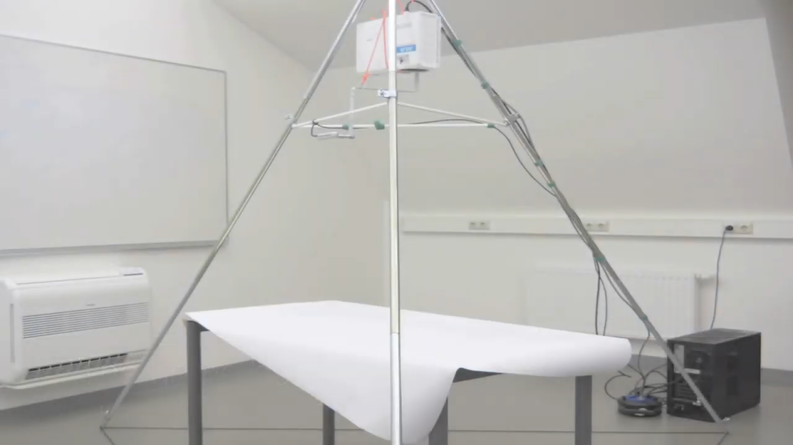
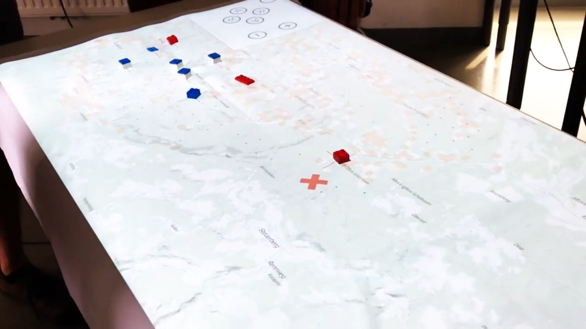
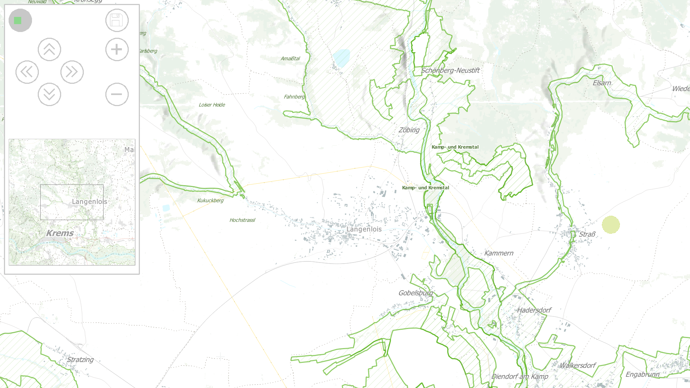
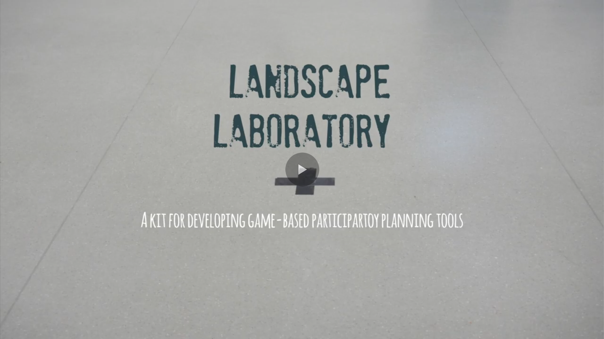

# LabTable

The LabTable is an open source application that can be used for geospatial planning projects.
A projector or large screen is used to display an image on a flat, vertical or horizontal surface.
Participants can now place interlocking bricks on the image to interact with the application.
A camera captures the bricks and image processing is used to calculate where each brick lies on the projected image.

Hardware Setup | Demonstration
:--|--:
 | 

# Setup
- Install required python packages: `pip install -r requirements.txt`
- Set correct values for "screen_height_mm", "opencv_device_nr" and "screen_id" in table-config.json
# Run
- Ensure the LabTable window of [Landscape.Lab](https://github.com/boku-ilen/landscapelab) is open
- Run the module from the repository root folder with `python -m LabTable`

# Configuration and Troubleshooting
## Camera settings
Camera parameters are configured differently on Windows and Linux. The parameter `"camera"/"opencv_device_nr"` is shared, determining which camera is used with OpenCV capture. This number can be found by calling the python module `cv2_enumerate_cameras`, installed by [cv2-enumerate-cameras package from PyPi](https://pypi.org/project/cv2-enumerate-cameras/). On Linux, this also provides the wrapper command `lscam`.
### Linux
Camera settings are set in table-config.json. Zoom and exposure are set by `"camera"/"opencv_zoom"` and `"camera"/"opencv_exposure"` respectively, and additional parameters and values can be added in `"camera"/"linux_options"`, with entries corresponding to any option settable by v4l2.

### Windows
Camera settings for Logitech Brio 4K are set using the Logi Options+ application.

## Camera calibration
In order to correctly undistort the image and perform accurate detection, the camera needs to be calibrated. If the zoom level changes, the calibration needs to be performed again.
Calibration is done using a checkerboard pattern with 7x10 internal corners (i.e. 8x11 total squares) of 19mm width. An A4 printable version can be found in the repository. In order to perform calibration, glue the printed checkerboard to a cardboard box or another flat, mobile surface. Call the script `calibrate_camera.py`, this will open a preview window. Hold the board in different positions and at different rotations throughout the field of view of the camera, and at different distances from the camera. When the chessboard is detected, a frame-grab will be taken automatically and "SNAP \[number of frames\]" will be printed in the console. 

Good results usually require 30 or more frames. Once there are enough frames, press N to move on to processing. After processing is complete, two windows will appear: the original image, and the undistorted one. If calibration worked, straight lines in the real environment should appear approximately straight in the undistorted image. To close the utility at this point, press Space. New calibration results are saved in the file `params.json` in the current folder. This file can be renamed and moved into `resources/camera_calibration_data/`, and applied in `table-config.json` under `"resources"/"calibration_file"/"path"`. 

## Important configuration parameters
| Path in `table-config.json`             | Description                                                                                             |
|-----------------------------------------|---------------------------------------------------------------------------------------------------------|
| camera/opencv_device_nr                 | Device number of the camera to be used. Can be found using `lscam` or `python -m cv2_enumerate_cameras` |
| camera/aruco_height_fraction            | Proportion (0.0-1.0) of the height of resources/aruco_screen taken up by the ArUco marker               |
| camera/calibration_refinement_threshold | Threshold value (0-255) applied to the green channel of the camera image in the corner refinement step  |
| resources/aruco_screen                  | Image file with ArUco marker with ID 0 from DICT_4x4_50                                                 |
| resources/edge_screen                   | Image file with green border for corner refinement                                                      |
| video_resolution/*                      | Camera resolution and framerate                                                                         |
| beamer_resolution/screen_height_mm      | Height of the projected image (bottom edge to top edge) in mm                                           |
| brick_colors                            | Color ranges for every class of recognized brick, given in pairs of HSV tuples.                         |

## Common issues
| Issue                                      | Solutions                                                                                                                                                                                                                                                                                                       |
| ------------------------------------------ | --------------------------------------------------------------------------------------------------------------------------------------------------------------------------------------------------------------------------------------------------------------------------------------------------------------- |
| Bad corner detection                       | Tweak camera/calibration_refinement_threshold until the window named "pts" shows only a continuous rectangle                                                                                                                                                                                                    |
| Bricks not recognized                      | Check that beamer_resolution/screen_height_mm is correctly set; Check whether the brick is clearly visible as an outline in the "edges" window - if not, adjust the saturation threshold with the "1"/"2" keys (see Runtime tuning); Adjust camera parameters (saturation, brightness, contrast, white balance) |
| Erroneous detection of map details         | Increase saturation threshold ("1"/"2" keys)                                                                                                                                                                                                                                                                    |
| Detection never finishes                   | Check if the full board is in view of the camera; Check light conditions and camera settings (ArUco should be clearly visible in the camera image)                                                                                                                                                              |
| Brick colors incorrectly detected          | Check camera white balance; Adjust brick_colors/...                                                                                                                                                                                                                                                             |
| High frame processing time                 | Usually due to erroneous detection of map details, see above                                                                                                                                                                                                                                                    |
| Projector artifacts in image (color bands) | Increase camera exposure until no longer visible                                                                                                                                                                                                                                                                |

## Runtime tuning
- "pts" window can be closed by pressing Space
- Brick detection can be tuned by adjusting the saturation threshold with "1"/"2" keys until only bricks are visible as outlines in the "edges" window.
	- "1" increases the value and "2" decreases it
	- The current value is visible in the main preview window.